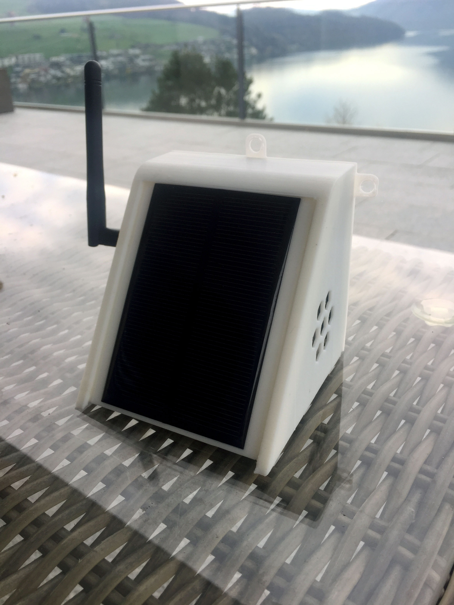
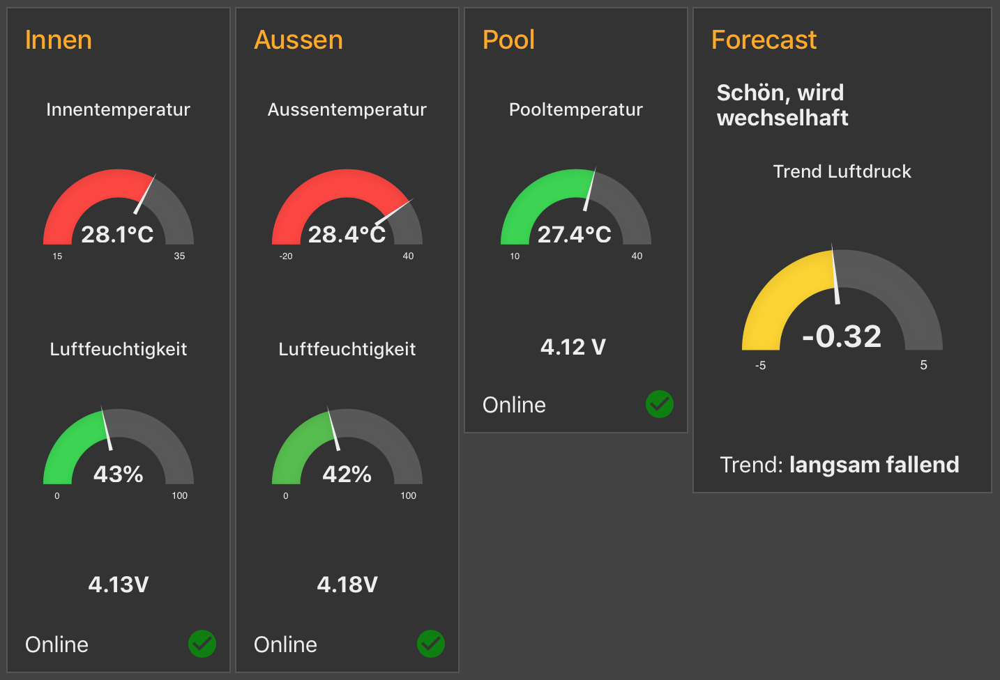

# Solar WiFi Weather Station V2.7 – API Edition

Basiert auf der Arbeit von [Open Green Energy](https://www.instructables.com/id/Solar-Powered-WiFi-Weather-Station-V20/).  
Ursprüngliche Autoren: Keith Hungerford, Debasish Dutta, Marc Stähli – vielen Dank!

Fork: https://github.com/esistich/Solar_WiFi_Weather_Station  
Branch: `feature/v2.7-config-portal-api`

---

## Was ist das?

Eine Solar-betriebene WiFi-Wetterstation auf Basis des **WEMOS D1 Mini Pro (ESP8266)**.  
Die Station misst Temperatur, Luftfeuchtigkeit, Luftdruck und Pooltemperatur,  
berechnet die **Zambretti-Wetterprognose** und sendet alle Daten an eine **PHP/MySQL-REST-API**.

---

## Sensoren

| Sensor  | Messung                              | Anschluss |
|---------|--------------------------------------|-----------|
| BME280  | Temperatur, Luftfeuchtigkeit, Druck  | I2C (D2/D1) |
| DS18B20 | Pooltemperatur                       | One-Wire D7 (GPIO13), 4,7 kΩ Pull-up |

---

## Repo-Struktur

```
Solar_WiFi_Weather_Station/
├── sketch_sws/
│   ├── Solar_WiFi_Weather_Station_v2_6.ino   # Haupt-Sketch
│   ├── Settings26.h                           # Nutzer-Konfiguration
│   └── Translations/
│       ├── Translation_DE.h
│       ├── Translation_EN.h
│       └── ... (IT, ES, FR, NL, NO, PL, RO, TR)
├── api/
│   ├── data.php          # POST Messung / GET letzter Datensatz  ← Firmware-Endpoint
│   ├── history.php       # GET Historien-Daten
│   ├── status.php        # Systemstatus
│   ├── index.html        # Platzhalter-Startseite
│   ├── .htaccess         # HTTPS-Weiterleitung + Schutz lib/
│   ├── lib/
│   │   ├── auth.php      # HTTP-Basic-Auth
│   │   └── db.php        # Datenbankverbindung
│   ├── homeassistant/
│   │   └── ha_sensors.yaml
│   ├── install/
│   │   └── schema.sql    # Datenbankschema + Migration
│   └── README.md         # API-Dokumentation
├── docs/
│   ├── IMG_2951.jpg
│   └── Node-Red-Dashboard.png
└── README.md
```

---

## Konfiguration

Alle Einstellungen in `sketch_sws/Settings26.h` (Compile-Zeit-Fallbacks).  
Zur Laufzeit per **Konfigurations-Portal** überschreibbar (im EEPROM gespeichert).

### Sprache wählen

```cpp
// sketch_sws/Settings26.h
#include "Translations/Translation_DE.h"
// #include "Translations/Translation_EN.h"
```

Sommer/Winter-Umschaltung (Regen ↔ Schnee) erfolgt automatisch anhand der gemessenen Temperatur.

### Neue Sprache hinzufügen

1. `Translation_DE.h` als `Translation_XX.h` kopieren
2. Alle Strings übersetzen, `{P}` und `{E}` Marker beibehalten
3. In `Settings26.h` das neue Include aktivieren
4. Pull Request willkommen!

---

## Konfigurations-Portal

Beim Booten **Button D6 gedrückt halten** → Station öffnet WLAN-Accesspoint **„SWS-Config"**.  
Browser öffnen: **http://192.168.4.1**

Konfigurierbar:
- WLAN-Zugangsdaten
- REST-API (Host, Pfad, Port, Benutzer, Passwort, HTTPS)
- Temperaturkorrektur, Höhe ü. NN, Schlafzeit

Das Portal läuft **ohne Zeitlimit**. Neustart nur per „Speichern" oder Hardware-Reset.

---

## REST-API

→ Vollständige Dokumentation: [`api/README.md`](api/README.md)

Deployment: `https://timm-sander.net/swsapi`

---

## Home Assistant Integration

→ Sensor-Definition: [`api/ha_sensors.yaml`](api/ha_sensors.yaml)

---

## Pin-Plan (WEMOS D1 Mini Pro)

| Pin | GPIO | Funktion             |
|-----|------|----------------------|
| D1  | 5    | I2C SCL (BME280)     |
| D2  | 4    | I2C SDA (BME280)     |
| D6  | 12   | Konfig-Button (LOW)  |
| D7  | 13   | DS18B20 One-Wire     |
| A0  | –    | Batteriespannung ADC |
| RST | –    | Deep-Sleep Wake      |

---

## Zambretti-Prognose

Die Station berechnet die [Zambretti-Wetterprognose](https://www.iquilezles.org/www/articles/zambretti/zambretti.htm)  
aus dem 6-Stunden-Druckverlauf. Daten werden lokal im SPIFFS gespeichert.  
`zambrettisays`, `zletter`, `trend` und `accuracy` werden mit jedem API-Upload übermittelt.

---

## Bibliotheken (Arduino IDE)

| Bibliothek              | Quelle                              |
|-------------------------|-------------------------------------|
| Adafruit BME280         | Arduino Library Manager             |
| Adafruit Unified Sensor | Arduino Library Manager             |
| DallasTemperature       | Arduino Library Manager             |
| OneWire                 | Arduino Library Manager             |
| EasyNTPClient           | https://github.com/aharshac/EasyNTPClient |
| Time (PaulStoffregen)   | Arduino Library Manager             |
| ArduinoJson             | Arduino Library Manager             |
| PubSubClient            | *nicht mehr benötigt*               |

---

## Fotos



Node-RED Dashboard (MQTT-Beispiel aus älteren Versionen):  


---

## Lizenz

Dieses Projekt basiert auf Open-Source-Arbeit und ist frei verwendbar.
